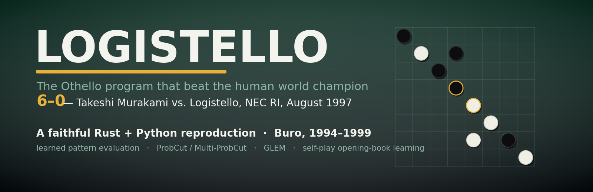

<p align="center">
  
</p>

[English](README.md) | [日本語](docs/ja/README.md)

# logistello

A faithful Rust + Python reproduction of Michael Buro's **Logistello** Othello
program (Buro, 1994-1999).

## Overview

Logistello was, for years, the strongest Othello program in the world; in 1997
it defeated the human world champion Takeshi Murakami **6-0**. This project
reproduces its key ideas from Buro's series of papers.

The reproduced ideas are: statistical pattern-based evaluation functions
learned from game records (Buro 1995 JAIR; 1997 NEC TR); **ProbCut** and
**Multi-ProbCut** selective alpha-beta pruning (Buro 1995 ICCA; 1997); **GLEM**
generalized linear evaluation models (Buro 1998 CG'98); and opening-book
learning (Buro 1999).

This is a reproduction study, not a from-scratch engine. The bitboard, move
generation, WTHOR I/O, and Edax integration come from the reusable
**[`rs-othello-sim`](https://github.com/akitenkrad/rs-othello-sim)** library,
pinned as a git dependency. The Logistello-specific contributions (Zobrist
hashing, NegaScout/PVS search, pattern evaluation, ProbCut/Multi-ProbCut,
opening-book learning) live in the `crates/` here.

## Installation

Prerequisites: **Rust 1.85+ / edition 2024**, [`uv`](https://docs.astral.sh/uv/)
for the Python tools, and (optionally) Edax v4.6 via `scripts/setup_edax.sh`.

This repository is a submodule of
[`social-simulation-replications`](https://github.com/akitenkrad/social-simulation-replications),
so obtain it with submodules:

```bash
git clone --recurse-submodules <repo-url>
# or, inside an existing clone:
git submodule update --init
```

Build, set up Python, and run one sanity check (from the repository root):

```bash
cargo build --release
uv sync
cargo run --release -p logistello-cli -- perft --depth 6   # => perft(depth=6) = 8200
```

`perft --depth 6` enumerating to `8200` confirms the reused move generator and
the local perft are wired correctly end-to-end.


## Scratch runs

Use `--scratch` for development, debugging, and smoke-test runs. Scratch runs are created under `results/_scratch/`, are never synced to the vault, and the latest scratch run can be located with `runvault path --scratch`.

## Documentation

Detailed, per-use-case guides (each bilingual EN/JA):

- [Getting started](docs/en/getting-started.md) — build, `perft`, `play`, `bench-search`, `selfplay`.
- [Evaluation training](docs/en/evaluation-training.md) — `extract` + Python `train-eval` → learned `PatternEval`.
- [ProbCut tuning](docs/en/probcut-tuning.md) — `probcut-fit`, single ProbCut & Multi-ProbCut.
- [GLEM features](docs/en/glem-features.md) — `glem-extract` + `train-glem` auto-generated conjunction features.
- [Opening book](docs/en/opening-book.md) — `learn-book` self-play book learning.
- [Murakami replay](docs/en/murakami-replay.md) — the 1997 6-0 gold validation set.
- [Edax & Elo](docs/en/edax-elo.md) — Edax v4.6 oracle, `elo-vs-edax`, `eval-correlation-edax`.
- [Sensitivity sweep](docs/en/sensitivity-sweep.md) — `sweep` + visualisation.
- [Full-scale reproduction](docs/en/full-scale-reproduction.md) — heavy, user-run paper-scale commands.

Reference data-format specs: [`WEIGHTS_FORMAT.md`](crates/logistello-eval/WEIGHTS_FORMAT.md),
[`EXTRACT_FORMAT.md`](crates/logistello-eval/EXTRACT_FORMAT.md),
[`GLEM_FORMAT.md`](crates/logistello-eval/GLEM_FORMAT.md),
[`BOOK_FORMAT.md`](crates/logistello-book/BOOK_FORMAT.md),
[`EDAX_SETUP.md`](EDAX_SETUP.md).

## Status

The full pipeline — search, pattern evaluation, ProbCut/Multi-ProbCut, GLEM,
opening-book learning, and the Murakami/Edax validation harness — is
implemented and verified end-to-end. The committed convenience runs use
*medium-scale* WThor-trained weights, so move-match and Elo numbers are weaker
than the design-doc §5 / historical targets — full-scale reproduction is
deliberately user-run (see [Full-scale reproduction](docs/en/full-scale-reproduction.md)).

## References

- Buro, M. (1995). "Statistical Feature Combination for the Evaluation of Game Positions." *JAIR* 3: 373-382.
- Buro, M. (1995). "ProbCut: An Effective Selective Extension of the αβ Algorithm." *ICCA Journal* 18(2): 71-76.
- Buro, M. (1997). "An Evaluation Function for Othello Based on Statistics." NEC Research Institute TR 31.
- Buro, M. (1997). "Experiments with Multi-ProbCut and a New High-Quality Evaluation Function for Othello." NEC Research Institute TR.
- Buro, M. (1997). "The Othello Match of the Year: Takeshi Murakami vs. Logistello." *ICCA Journal* 20(3): 189-193.
- Buro, M. (1998). "From Simple Features to Sophisticated Evaluation Functions." In *Computers and Games (CG'98)*, Springer LNCS 1558, 126-145.
- Buro, M. (1999). "Toward Opening Book Learning." *ICCA Journal* 22(2): 98-102.
- Buro, M. (2002). "Improving Heuristic Mini-Max Search by Supervised Learning." *Artificial Intelligence* 134: 85-99.
- Delorme, R. (2003-). *Edax — A Strong Othello/Reversi Program.* Open-source successor to Logistello; used here as an oracle.
- Fédération Française d'Othello. *WTHOR Database.* World-championship game archive used for evaluation-function learning.

## License

MIT. See [LICENSE](LICENSE).
